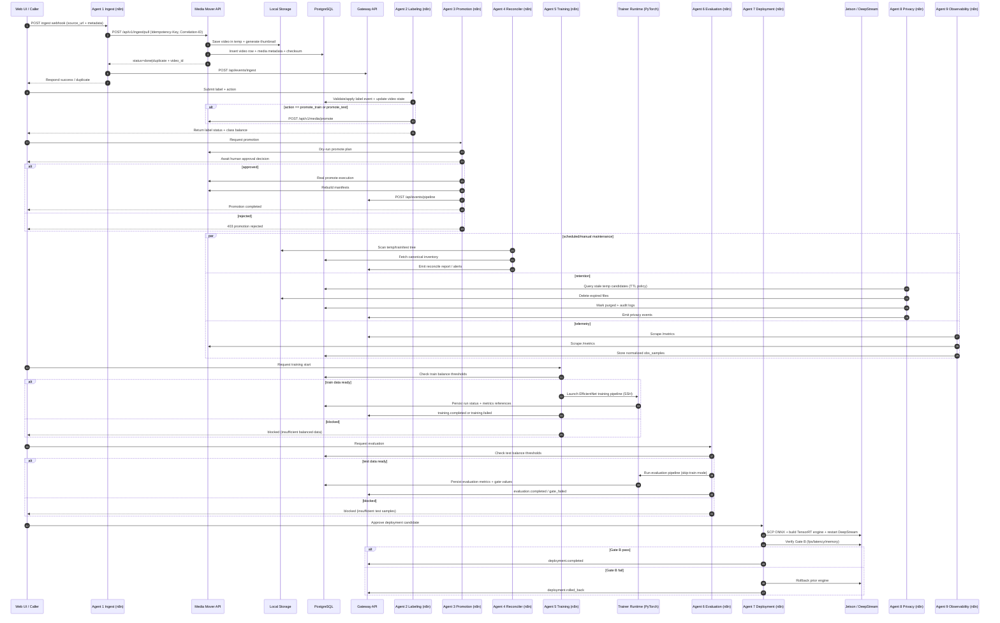

# Reachy 08.4.2 — Request-to-Deployment Sequence Diagram (Single Page)

This page gives Rusty (and delivery stakeholders) one end-to-end view of how a video request moves through the n8n agentic system to model deployment.

## End-to-end sequence (Agent 1 -> Agent 9)

## How to read this diagram (control-flow focus)
- **Linear data path:** Ingest -> Labeling -> Promotion -> Training/Evaluation -> Deployment.
- **Policy/ops side paths:** Reconciler, Privacy, and Observability run alongside the main path to keep state clean, compliant, and measurable.
- **Approval gates:** Promotion and deployment include explicit human decision points.
- **Metric gates:** Gate A (training/eval quality) and Gate B (runtime performance) decide if the system can progress safely.

## Key engineering invariants shown by the sequence
1. All mutating operations carry idempotency/correlation context.
2. Filesystem + DB state changes are paired with event emission for auditability.
3. Deployment is reversible by design (rollback branch is first-class, not an afterthought).
4. Maintenance/telemetry agents are continuous controls, not optional extras.
